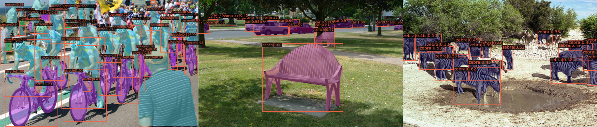

# My Project Plan

**Note**: This document is written merely as an illustrative example, and does not provide any working guide to an actual project.

### Proposal
I am planning to make a computer vision software that detects objects in images.
In order to build it, I will use [TensorFlow](https://www.tensorflow.org) and [PyTorch](https://pytorch.org), deep learning libraries, as well as other open source software.

---

For example, the objects in the following images were detected using [mmdetection](https://github.com/open-mmlab/mmdetection?tab=readme-ov-file):


<p align = "center">
  
 
</p>

---

### Dependencies
- python
- opencv-python
- tensorflow
- openmmlab
- package manager

### Installation
In a bash terminal, run the following commands (Do NOT actually run these commands in your computer):
```bash
$ sudo apt update
$ conda create -n cv_detection
$ conda activate cv_detection
$ python --version
$ python example.py
